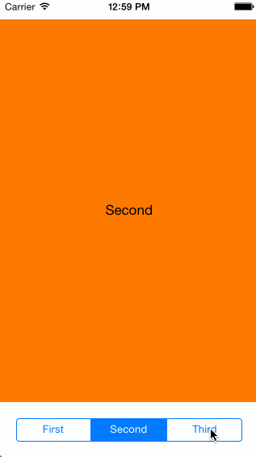
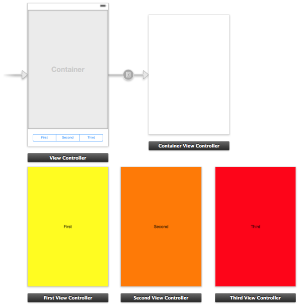

GRKContainerViewController
===========
A container UIViewController providing the ability to easily transition from one contained
view controller to another, with an optional animation.

#### Future Ideas

* Allow custom transition animations.

### Installing

If you're using [CocoPods](http://cocopods.org) it's as simple as adding this to your `Podfile`:

	pod 'GRKContainerViewController', '~> 1.0'

otherwise, simply add `GRKContainerViewController.h` and `GRKContainerViewController.m` to
your project.

### Documentation

`GRKContainerViewController` was designed to be used as the mechanism to swap out view
controllers in a predefined location upon some action, like the selection of a
segmented control.

The main API is simple:

	- (void)setViewController:(UIViewController *)viewController animated:(BOOL)animated completion:(void(^)(UIViewController *viewController))completion;

which should be called when a new view controller is to be displayed inside the container.

Optionally you can set the `viewController` property, which will change the displayed view
controller, but without any transition animation.

Below is a screen shot of a typical storyboard setup (taken from the sample app in the
repository). This configuration allows for easy embedding of view controllers which can be
swapped programmatically with the GRKContainerViewController.

Additional documentation is available in `GRKContainerViewController.h` and example usage
can be found in the GRKContainerViewControllerTestApp source.

#### Disclaimer and Licence

* This work is licensed under the [Creative Commons Attribution 3.0 Unported License](http://creativecommons.org/licenses/by/3.0/).
  Please see the included LICENSE.txt for complete details.

#### About
A professional iOS engineer by day, my name is Levi Brown. Authoring a technical blog
[grokin.gs](http://grokin.gs), I am reachable via:

Twitter [@levigroker](https://twitter.com/levigroker)  
App.net [@levigroker](https://alpha.app.net/levigroker)  
Email [levigroker@gmail.com](mailto:levigroker@gmail.com)  

Your constructive comments and feedback are always welcome.
